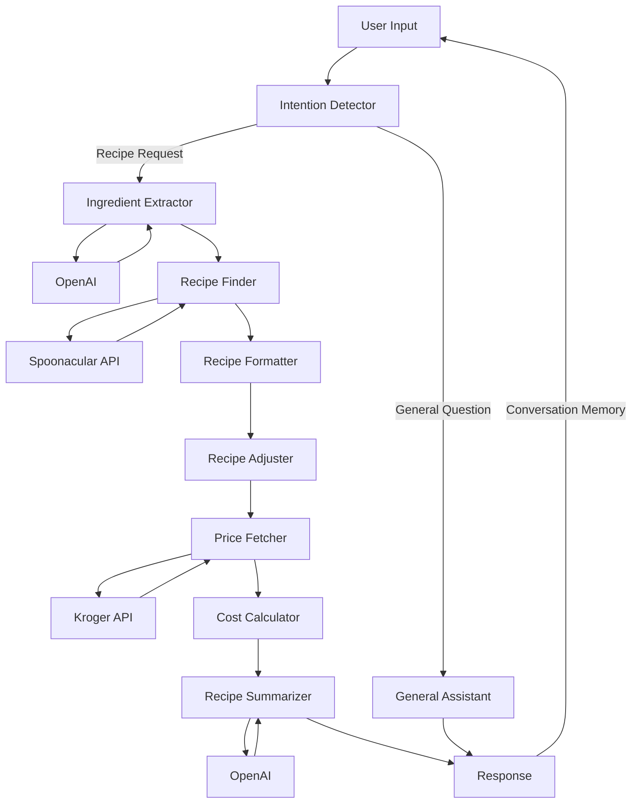

# SiCa Kitchen

SiCa Kitchen is a MVP application built with Streamlit that serves as an agentic kitchen chef assistant. The project combines backend AI capabilities with a user-friendly frontend interface to help users with their cooking needs.

## 🌟 Features

- Recipe recommendations based on available ingredients
- Cost estimation for missing ingredients
- Dynamic, personality-driven recipe summaries
- Interactive chat interface with SiCa's unique personality
- Structured logging with debug and production levels
- Integration with Spoonacular API and the Kroger API for recipe data and ingredient price, availability, and nutritional information
- OpenAI integration for natural language processing

## 🚀 Technical Architecture

### Multi-Agent System

The backend implements a multi-agent workflow consisting of several specialized agents:

1. **Intention Detector**
   - Analyzes user input to determine the type of request
   - Distinguishes between recipe searches and general cooking questions
   - Uses AI to accurately classify user intentions
   - Debug-level logging for detailed request analysis

2. **Ingredient Extractor**
   - Extracts ingredient lists from natural language input
   - Uses OpenAI with specialized prompts for accurate ingredient parsing
   - Normalizes ingredient names for API compatibility
   - Debug-level logging for ingredient extraction details

3. **Recipe Finder**
   - Integrates with Spoonacular API with retry mechanisms
   - Scores recipes based on:
     - Main ingredient usage
     - Available vs. missing ingredient ratio
     - Recipe title relevance
   - Filters and ranks recipe matches
   - Handles API timeouts and errors gracefully

4. **Recipe Formatter**
   - Structures raw recipe data into a consistent format
   - Prepares recipe information for AI processing
   - Ensures data consistency across the system

5. **Recipe Adjuster**
   - Identifies missing ingredients
   - Compares recipe requirements with available ingredients
   - Provides ingredient substitution suggestions

6. **Price Fetcher & Cost Calculator**
   - Integrates with Kroger API for real-time pricing
   - Calculates total cost of missing ingredients
   - Provides itemized cost breakdown

7. **Recipe Summarizer**
   - Creates dynamic, personality-driven recipe summaries
   - Uses SiCa's unique voice and style
   - Includes preparation time and servings
   - Adds cost information for shopping
   - Falls back to basic summary if AI generation fails

8. **General Assistant**
   - Handles general cooking questions with SiCa's personality
   - Provides cooking tips and advice
   - Maintains conversation context

### Logging Architecture

The system implements a structured logging approach:
- High-level workflow logging in the orchestrator
- Debug-level detailed logging in individual agents
- Error logging with full context capture
- Clear separation between production and debug information

### Agentic Workflow Schema

This schema shows the core agent workflow:

1. User input is first analyzed by the Intention Detector
2. For recipe-related requests:
   - Ingredient Extractor processes the ingredients
   - Recipe Finder locates suitable recipes
   - Recipe Formatter structures the data
   - Recipe Adjuster identifies missing ingredients
   - Price Fetcher gets pricing information
   - Cost Calculator determines total costs
   - Recipe Summarizer creates a personality-driven response
3. For general questions:
   - General Assistant handles the request with SiCa's personality
4. The response feeds back into the conversation memory

Each agent is specialized for its specific task, working together in a pipeline to process recipe-related requests efficiently while maintaining conversation context and SiCa's unique personality throughout the interaction.

The system is designed to be:
- Modular and maintainable
- Resilient to API failures
- Consistent in personality
- Efficient in logging and debugging