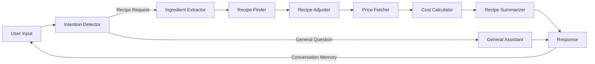

# SiCa Kitchen

SiCa Kitchen is a MVP application built with Streamlit that serves as an agentic kitchen chef assistant. The project combines backend AI capabilities with a user-friendly frontend interface to help users with their cooking needs.

## 🌟 Features

- Recipe recommendations based on available ingredients
- Cost estimation for missing ingredients
- Detailed recipe instructions and summaries
- Interactive chat interface
- Real-time execution logging
- Integration with Spoonacular API and the Kroger API for recipe data and ingredient price, availability, and nutritional information
- OpenAI integration for natural language processing

## 🚀 Technical Architecture

### Multi-Agent System

The backend implements a multi-agent workflow consisting of several specialized agents:

1. **Intention Detector**
   - Analyzes user input to determine the type of request
   - Distinguishes between recipe searches and general cooking questions
   - Routes requests to appropriate agents

2. **Ingredient Extractor**
   - Extracts ingredient lists from natural language input
   - Uses OpenAI for accurate ingredient parsing
   - Normalizes ingredient names for API compatibility

3. **Recipe Finder**
   - Integrates with Spoonacular API
   - Scores recipes based on:
     - Main ingredient usage
     - Available vs. missing ingredient ratio
     - Recipe title relevance
   - Filters and ranks recipe matches

4. **Recipe Adjuster**
   - Identifies missing ingredients
   - Compares recipe requirements with available ingredients
   - Provides ingredient substitution suggestions

5. **Price Fetcher & Cost Calculator**
   - Integrates with Kroger API for real-time pricing
   - Calculates total cost of missing ingredients
   - Provides itemized cost breakdown

6. **Recipe Summarizer**
   - Creates user-friendly recipe summaries
   - Formats cooking instructions
   - Includes preparation time and servings
   - Adds cost information for shopping

7. **General Assistant**
   - Handles general cooking questions
   - Provides cooking tips and advice
   - Maintains conversation context

### Agentic Workflow Schema

This schema shows the core agent workflow:

1. User input is first analyzed by the Intention Detector to determine the type of request
2. For recipe-related requests:
   - Ingredient Extractor processes the ingredients
   - Recipe Finder locates suitable recipes
   - Recipe Adjuster identifies missing ingredients
   - Price Fetcher gets pricing information
   - Cost Calculator determines total costs
   - Recipe Summarizer creates the final response
3. For general questions:
   - General Assistant handles the request directly
4. The response feeds back into the conversation memory, allowing for contextual follow-up questions and continuous interaction

Each agent is specialized for its specific task, working together in a pipeline to process recipe-related requests efficiently while maintaining conversation context.

The agents work together to:
- Understand user intent
- Extract and process ingredients
- Find suitable recipes
- Calculate costs
- Generate comprehensive responses

Each component is designed to be modular and handle specific aspects of the recipe recommendation process, making the system maintainable and extensible.